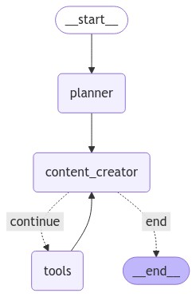

# LLM Experiments

Repository for running various experiments with Large Language Models (LLMs) and exploring different GenAI frameworks and approaches.

## Experiments

### Deep Research Assistant
- Multi-round research generation using LangGraph orchestration
- Topic-based Q&A with validation and summarization
- Examples: NFL GOAT analysis, Bitcoin investment research, Tesla purchase decision making

  

### Social Media Agentic Team
- Experiment with an agentic team of social media agents. Given a topic / social media post idea, multiple agents will kick off to generate content for specific social media platforms.

  <h4>Agentic Flow (Platform-agnostic)</h4>
  

### Ambient Agent
- Experiment with an ambient agent that can be used to interact with the user in a chat-like manner.
  - Slack integration for human-in-the-loop ([Jupyter Notebook](nb/ambient_experiment/test_tools.ipynb))
    - Handles images, text, and basic file uploads
  - tbd

*More experiments to be added...*

## Tests

### Anthropic Citations

- Testing new `citations` feature in Anthropic
- Providing plain txt files, PDFs for 'RAG'-like tasks, such as QA and summarization - checking reference capabilities of `claude-3-5-sonnet-20241022`
- [Jupyter Notebook](nb/anthropic-citations.ipynb)

### OpenAI Response API and Agents Framework

- Response API
  - [Jupyter Notebook](nb/openai-response-api-experiments.ipynb)
  - structured output (json_schema)
  - web search tool
    - compare `gpt-4o-search-preview` model with `gpt-4o` + web search tool in Response API
    - multiple tools at once
  - file search tool
    - explore direct vector search (manual RAG) vs. file search tool
    - custom chunking and retrieval settings
  - Computer Use tool
    - Installed playwright browser to use it as a tool in the agentic loop
    - Due to Zero Data Retention policy of OpenAI, the tool is not yet available for me for testing
    - In a browser, a screenshot is taken to decide on the next action
  - Conversation State
    - `previous_response_id` is used to handle the conversation history if org does not have Zero Data Retention policy

- Agents Framework tests to be added...
 - [Jupyter Notebook](nb/openai-agents-framework-experiments.ipynb)

## Tech Stack

### Frameworks & Libraries
- LangGraph
- LangChain
- OpenAI SDK
- Perplexity AI

## Setup

1. Create virtual environment
2. Install requirements: `pip install -r requirements.txt`
3. Create `.env` file with required API keys

For `playwright` to work, you need to:
1. pip install pytest-playwright
2. playwright install

## Notes

This is a personal experimental repository for testing and learning about different LLM implementations and approaches. Experiments are typically contained in Jupyter notebooks for easy iteration and visualization. 