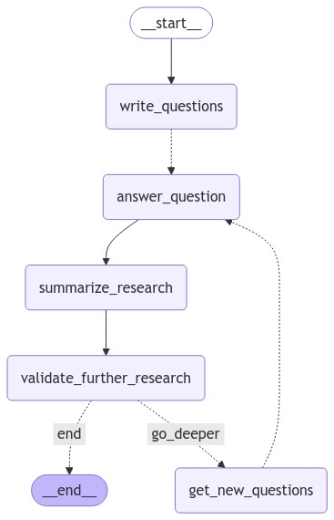

# LLM Experiments

Repository for running various experiments with Large Language Models (LLMs) and exploring different GenAI frameworks and approaches.

## Experiments

### Deep Research Assistant
- Multi-round research generation using LangGraph orchestration
- Topic-based Q&A with validation and summarization
- Examples: NFL GOAT analysis, Bitcoin investment research, Tesla purchase decision making

  

### Social Media Agentic Team
- Experiment with an agentic team of social media agents. Given a topic / social media post idea, multiple agents will kick off to generate content for specific social media platforms.

  <h4>Agentic Flow (Platform-agnostic)</h4>
  

*More experiments to be added...*

## Tests

### Anthropic Citations

- Testing new `citations` feature in Anthropic
- Providing plain txt files, PDFs for 'RAG'-like tasks, such as QA and summarization - checking reference capabilities of `claude-3-5-sonnet-20241022`
- [Jupyter Notebook](nb/anthropic-citations.ipynb)

## Tech Stack

### Frameworks & Libraries
- LangGraph
- LangChain
- OpenAI SDK
- Perplexity AI

## Setup

1. Create virtual environment
2. Install requirements: `pip install -r requirements.txt`
3. Create `.env` file with required API keys

## Notes

This is a personal experimental repository for testing and learning about different LLM implementations and approaches. Experiments are typically contained in Jupyter notebooks for easy iteration and visualization. 